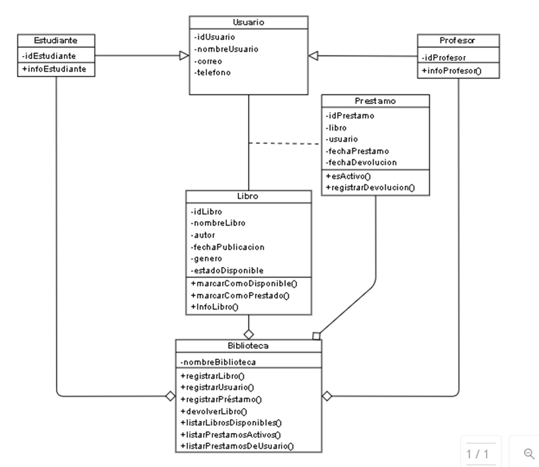

# Sistema de Biblioteca

Práctica de laboratorio desarrollada en **Java** aplicando **Programación Orientada a Objetos (POO)**, como parte del curso Compiladores de 5to ciclo de Ingeniería Informática — Universidad Nacional de Trujillo.

## Descripción

Sistema de gestión de biblioteca que permite registrar usuarios (estudiantes y profesores), registrar libros, gestionar préstamos y devoluciones, y consultar disponibilidad de materiales. La interfaz gráfica fue construida con Java Swing (NetBeans GUI Builder).

## Diagrama de clases

## Estructura del proyecto

- `src/biblioteca/` — Lógica de negocio: `Usuario`, `Estudiante`, `Profesor`, `Libro`, `Prestamo`, `Biblioteca`.
- `src/interfaz/` — Interfaces gráficas (Swing) para registro de libros, préstamos, devoluciones y consultas.

## Funcionalidades principales

- Registro de usuarios (estudiantes y profesores) con herencia desde una clase base `Usuario`.
- Registro y disponibilidad de libros.
- Registro de préstamos y devoluciones, con control de estado (activo/disponible).
- Listado de libros disponibles, préstamos activos y préstamos por usuario.
- Validación de datos de ingreso mediante expresiones regulares.

## Requisitos

- JDK 8 o superior
- NetBeans IDE (el proyecto incluye configuración de proyecto NetBeans)

## Cómo ejecutar

1. Abrir el proyecto en NetBeans (`Archivo > Abrir Proyecto`).
2. Compilar y ejecutar la clase `Biblioteca_Pestana_Inicio` dentro de `src/interfaz`.

## Autor

Enrique — Escuela Profesional de Informática, UNT
